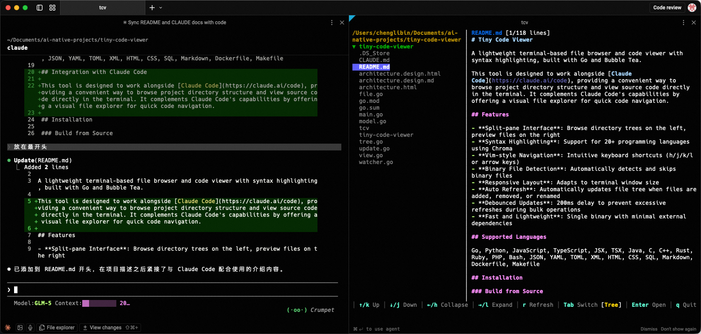

# Tiny Code Viewer



A lightweight terminal-based file browser and code viewer with syntax highlighting, built with Go and Bubble Tea.

This tool is designed to work alongside [Claude Code](https://claude.ai/code), providing a convenient way to browse project directory structure and view source code directly in the terminal. It complements Claude Code's capabilities by offering a visual file explorer for quick code navigation.

## Features

- **Split-pane Interface**: Browse directory trees on the left, preview files on the right
- **Syntax Highlighting**: Support for 20+ programming languages using Chroma
- **Vim-style Navigation**: Intuitive keyboard shortcuts (h/j/k/l or arrow keys)
- **Binary File Detection**: Automatically detects and skips binary files
- **Responsive Layout**: Adapts to terminal window size
- **Auto Refresh**: Automatically updates file tree when files are added, removed, or renamed
- **Debounced Updates**: 200ms delay to prevent excessive refreshes during bulk operations
- **Fast and Lightweight**: Single binary with minimal external dependencies

## Supported Languages

Go, Python, JavaScript, TypeScript, JSX, TSX, Java, C, C++, Rust, Ruby, PHP, Bash, JSON, YAML, TOML, XML, HTML, CSS, SQL, Markdown, Dockerfile, Makefile

## Installation

### Go Install

```bash
go install github.com/asathinkeroops/tiny-code-viewer@latest
```

### Build from Source

```bash
# Clone the repository
git clone https://github.com/asathinkeroops/tiny-code-viewer.git
cd tiny-code-viewer

# Build
go build -o tcv

# Optional: Install to $GOPATH/bin
go install
```

### Requirements

- Go 1.24.0 or later

## Usage

```bash
# View current directory
./tcv

# View a specific directory
./tcv /path/to/project

# View a specific file's parent directory
./tcv /path/to/file.go
```

## Keyboard Shortcuts

| Key | Action |
|-----|--------|
| `↑` / `k` | Move cursor up |
| `↓` / `j` | Move cursor down |
| `←` / `h` | Collapse directory |
| `→` / `l` | Expand directory / Open file |
| `Enter` / `Space` | Toggle directory / Open file |
| `r` | Refresh file tree (manual) |
| `Tab` | Switch focus between tree and preview panels |
| `q` / `Ctrl+C` | Quit |

## Auto Refresh

The viewer automatically watches for file system changes:
- **Auto-refresh**: File tree updates automatically when files are added, removed, or renamed
- **Debouncing**: Changes are batched with 200ms delay to avoid excessive refreshes during bulk operations
- **Smart watching**: Only expanded directories are watched for better performance

## User Interface

```
┌─────────────────────────────────────────────────────────────────┐
│ /path/to/directory          │  main.go [1/150 lines]            │
│ ▼ src                       │  package main                     │
│   ▶ cmd                     │                                   │
│   ▶ internal                │  func main() {                    │
│     main.go                 │      m := initialModel()          │
│     config.go               │      p := tea.NewProgram(m)       │
│ ▼ pkg                       │      // ...                       │
│   utils.go                  │  }                                │
│                             │                                   │
├─────────────────────────────────────────────────────────────────┤
│ ↑/k:Up ↓/j:Down ←/h:Collapse →/l:Expand r:Refresh ... [Tree]   │
└─────────────────────────────────────────────────────────────────┘
```

## Dependencies

- [bubbletea](https://github.com/charmbracelet/bubbletea) - TUI framework (Elm Architecture)
- [lipgloss](https://github.com/charmbracelet/lipgloss) - Terminal styling
- [chroma](https://github.com/alecthomas/chroma) - Syntax highlighting engine
- [fsnotify](https://github.com/fsnotify/fsnotify) - File system notification

## Project Structure

```
tiny-code-viewer/
├── main.go     # Application entry point and initialization
├── model.go    # Data structures and styling definitions
├── tree.go     # File tree building and flattening
├── file.go     # File loading and language detection
├── watcher.go  # File system watching and auto-refresh
├── update.go   # Message handling and state updates
├── view.go     # UI rendering
├── go.mod      # Go module definition
├── go.sum      # Dependency checksums
└── README.md   # This file
```

## License

MIT License